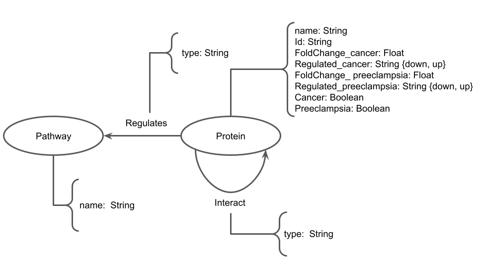

# Projeto: Estudo Comparativo das Alterações Proteômicas e Funcionais da Placenta em Diabetes, Câncer e Pré-eclâmpsia
# Project: Comparative Study of Proteomic and Functional Changes in the Placenta during Diabetes, Cancer and Pre-eclampsia

## Descrição Resumida do Projeto
### Contexto/Motivação
O projeto visa analisar comparativamente as alterações proteômicas e funcionais da placenta associadas à diabetes, pré-eclâmpsia e câncer. Essas três doenças são frequentes durante a gestação e acarretam patologias na placenta e, consequentemente, ao feto. Portanto, temos como objetivo investigar o relacionamento dos padrões proteômicos e funcionais de placenta de indivíduos com diabetes gestacional, câncer e pré-eclâmpsia.

### Análise
Para o desenvolvimento deste projeto serão utilizadas diferentes ferramentas, tais como PubMed e Scorpus para procurar artigos relacionados com o tema; Cytoscape e Sting para a construção das redes de interação proteína-proteína; Reactome para analisar as vias alteradas. Por meio dessa análise, será possível verificar que diabetes gestacional, câncer e pré-eclâmpsia podem gerar modulações a nível proteico e funcional semelhantes na placenta.

## Slides

## Fundamentação Teórica
Os artigos que serão tomados como base para a fundamentação teórica do problema em saúde/biologia:
* Placental structural abnormalities in gestational diabetes and when they develop: A scoping review[^1]
* Fetoplacental oxygen homeostasis in pregnancies with maternal diabetes mellitus and obesity[^2]
* Pre-eclampsia[^3]
* Proteomic Approaches in the Study of Placenta of Pregnancy Complicated by Gestational Diabetes Mellitus[^4]
* Pregnancy and Cancer: Cellular Biology and Mechanisms Affecting the Placenta[^5]
* Management of pregnancy in women with cancer[^6]

Com foco em investigar como se relacionam os padrões proteômicos e funcionais de placenta de indivíduos com diabetes gestacional, câncer e pré-eclâmpsia.

## Perguntas de Pesquisa
### Pergunta
Como se relacionam os padrões proteômicos e funcionais de placenta de indivíduos com diabetes gestacional, câncer e pré-eclâmpsia?  
### Hipótese
Diabetes gestacional, câncer e pré-eclâmpsia podem gerar modulações a nível proteico e funcional semelhantes na placenta.

## Metodologia
O projeto pretende explorar o problema seguindo a seguinte metodologia:
1. Seleção dos artigos relevantes com foco em pré-clínico e proteômicas (critério de inclusão);
2. Determinar lista de proteínas alteradas a serem estudadas;
3. Filtrar em relação ao grau de expressão, separando em aumento ou diminuição da expressão;
4. Construir e analisar as redes de interação proteína-proteína para cada doença;
* Utilizar técnicas exploratórias de ciência de redes, tais como: análise de centralidade para identificar proteínas mais relevantes que são afetadas pelas doenças; identificação de comunidades de proteínas que podem se repetir entre as diferentes doenças.
6. Analisar as vias biológicas afetadas.

## Bases de Dados e Evolução
> Base de Dados | Endereço na Web | Resumo descritivo
> ----- | ----- | -----
> STRING |[string-db](https://string-db.org/) | Base de dados de interações conhecidas e preditas entre proteínas (PPI). Inclui associações diretas (físicas) e indiretas (funcionais).
> Reactome | [Reactome](https://reactome.org/) | Base de dados contendo conhecimento sobre processos e vias biológicas.
> Scopus | [Scopus](https://www.scopus.com/home.uri) | Repositório para busca de artigos relacionados ao projeto. Tais artigos podem disponibilizar bases de dados usadas posteriormente no projeto.
> PubMed | [PubMed](https://pubmed.ncbi.nlm.nih.gov/) | Repositório de literatura biomédica.

## Modelo Lógico

## Integração entre Bases

## Análise Preliminar

## Evolução do Projeto

## Ferramentas
* PubMed, Scopus --> Busca de artigos
* STRING (string-db) --> Database para redes do tipo Protein-protein Interaction (PPI)
* Reactome --> Database de vias biológicas
* NEO4J, Cytoscape --> Construção e análise das redes PPI

## Referências Bibliográficas
[^1]: Erin Ehlers, Omonseigho O. Talton, Danny J. Schust, Laura C. Schulz,
Placental structural abnormalities in gestational diabetes and when they develop: A scoping review. Placenta, Volume 116, 2021, Pages 58-66. https://doi.org/10.1016/j.placenta.2021.04.005
[^2]: Desoye, G., Carter, A.M. Fetoplacental oxygen homeostasis in pregnancies with maternal diabetes mellitus and obesity. Nat Rev Endocrinol 18, 593–607 (2022). https://doi.org/10.1038/s41574-022-00717-z
[^3]: Dimitriadis, E., Rolnik, D.L., Zhou, W. et al. Pre-eclampsia. Nat Rev Dis Primers 9, 8 (2023). https://doi.org/10.1038/s41572-023-00417-6
[^4]:Lapolla A, Traldi P. Proteomic Approaches in the Study of Placenta of Pregnancy Complicated by Gestational Diabetes Mellitus. Biomedicines. 2022; 10(9):2272. https://doi.org/10.3390/biomedicines10092272
[^5]:Oliveira MdMS, Salgado CdM, Viana LR, Gomes-Marcondes MCC. Pregnancy and Cancer: Cellular Biology and Mechanisms Affecting the Placenta. Cancers. 2021; 13(7):1667. https://doi.org/10.3390/cancers13071667
[^6]: Wolters V, Heimovaara J, Maggen C, et al Management of pregnancy in women with cancer International Journal of Gynecologic Cancer 2021;31:314-322. https://doi.org/10.1136/ijgc-2020-001776
