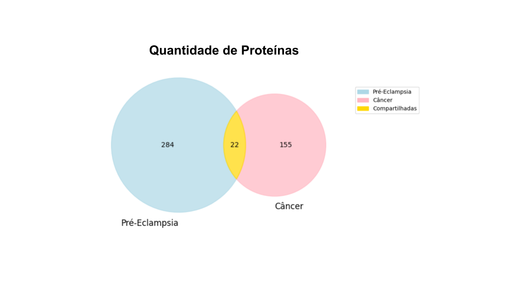
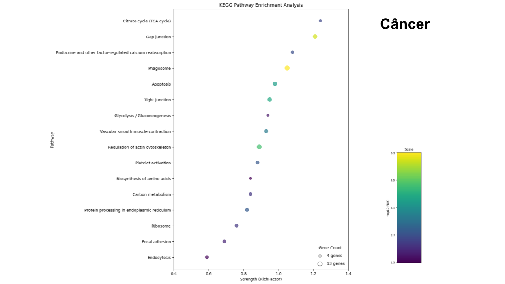

# Projeto: Estudo Comparativo das Alterações Proteômicas e Funcionais da Placenta em Diabetes, Câncer e Pré-eclâmpsia
# Project: Comparative Study of Proteomic and Functional Changes in the Placenta during Diabetes, Cancer and Pre-eclampsia

## Descrição Resumida do Projeto
## Contexto/Motivação
O projeto tem como objetivo realizar uma análise comparativa das alterações proteômicas e funcionais da placenta associadas à pré-eclâmpsia e ao câncer. Ambas as condições são frequentes durante a gestação e podem resultar em complicações placentárias significativas, afetando diretamente o desenvolvimento fetal. Investigar as modulações das proteínas na placenta de gestantes com câncer ou pré-eclâmpsia, bem como suas interações e o impacto nas vias biológicas, pode revelar padrões proteômicos e funcionais essenciais para o entendimento e tratamento dessas doenças.

## Análise/Resultados 
Para alcançar esse objetivo, serão utilizadas diversas ferramentas, como PubMed e Scopus para revisão bibliográfica, STRING para construção de redes de interação proteína-proteína, Python para integração e validação dos dados, KEGG para análise das vias biológicas afetadas, e Cytoscape para a visualização e análise das redes complexas geradas. Os resultados obtidos indicam que essas condições compartilham alterações similares em termos de proteínas e vias funcionais no tecido placentário. No entanto, dada a natureza abrangente das análises ômicas, será crucial realizar análises adicionais para aprofundar o estudo das vias por meio de expressão gênica e proteica.

## Slides
[Apresentação Projeto P3](assets/slides/apresentacao_projeto_p3.pdf)

## Fundamentação Teórica
Os artigos que serão tomados como base para a fundamentação teórica do problema em saúde/biologia:
* Pre-eclampsia[^6]:
    * Utilizado para fundamentação teórica da descrição da pré-eclâmpsia.
* Use of Traditional and Proteomic Methods in the Assessment of a Preclinical Model of Preeclampsia[^9]:
    * Utilizado os dados proteômicos para realização das análises
* Pregnancy and Cancer: Cellular Biology and Mechanisms Affecting the Placenta [^5]
    * Utilizado para a fundamentação teórica da descrição de alterações do câncer durante a gestação
* Management of pregnancy in women with cancer International Journal of Gynecologic Cancer[^12]:
    * Foi utilizado para a fundamentação teórica da descrição de alterações do câncer durante a gestação.

O foco da pesquisa nesses artigos é investigar as alterações em padrões proteômicos e funcionais de placenta de indivíduos com câncer e pré-eclâmpsia.

## Perguntas de Pesquisa
### Pergunta
Como se relacionam os padrões proteômicos e funcionais de placenta de indivíduos com câncer e pré-eclâmpsia?  
### Hipótese
Câncer e pré-eclâmpsia podem gerar modulações a nível proteico e funcional semelhantes na placenta.

O projeto de pesquisa ajudou a analisar as modulações proteicas nas duas condições: câncer e pré-eclâmpsia. Foi possível verificar se nessas circunstâncias existiam alterações proteômicas e das vias biológicas de forma similar para ambas doenças no tecido placentário. Além disso, conseguimos identificar o sentido da regulação dessas vias em cada doença dada a informação das proteínas relacionadas.

## Metodologia
O projeto pretende explorar o problema seguindo a seguinte metodologia:
1. Seleção dos artigos relevantes com foco em estudos pré-clínico em placenta com análises proteômicas (critério de inclusão de proteínas e vias biológicas);
2. Curadoria dos dados da proteômica, selecionando as proteínas alteradas a serem estudadas;
3. Filtragem de proteínas em relação ao grau de expressão, separando as que apresentam maior ou menor expressão diferencial;
4. Construção e análise das redes de interação proteína-proteína para cada doença;
5. Integração das redes de ambas doenças e análise das proteínas em comum;
* Utilizar técnicas exploratórias de ciência de redes, tais como: análise de centralidade para identificar proteínas mais relevantes que são afetadas pelas doenças e se elas se mantêm centrais em ambas as redes; 
5. Aplicação de métodos de análise de enriquecimento com vias biológicas, construindo a rede heterogênea de associação entre as vias e as proteínas alteradas. 
6. Integração das redes enriquecidas de cada doença de forma a gerar uma rede com as vias biológicas em comum.
* Utilização da rede resultante para identificar os principais mecanismos biológicos associados às duas doenças. Identificação de comunidades que podem ser similares entre as diferentes doenças.

## Bases de Dados e Evolução
> Base de Dados | Endereço na Web | Resumo descritivo
> ----- | ----- | -----
> STRING |[string-db](https://string-db.org/) | Base de dados de interações conhecidas e preditas entre proteínas (PPI). Inclui associações diretas (físicas) e indiretas (funcionais).
> KEGG | [Kegg](https://www.genome.jp/kegg/) | B Base de dados contendo conhecimento sobre redes de interação molecular nas células e variantes específicas a determinado organismo.
> Scopus | [Scopus](https://www.scopus.com/home.uri) | Repositório para busca de artigos relacionados ao projeto. Tais artigos podem disponibilizar bases de dados usadas posteriormente no projeto.
> PubMed | [PubMed](https://pubmed.ncbi.nlm.nih.gov/) | Repositório de literatura biomédica.

Os dados de proteínas alteradas que foram extraídos de artigos do Scopus/PubMed e do projeto do  foram tratados para serem compatíveis com o STRING e gerar as redes de interação. Assim, foi necessário mapear os identificadores de proteínas utilizados pelos artigos (UNIPROT) para os genes referentes, uma vez que o STRING utiliza o nome do gene como identificador dos nós das redes.
Além disso, algumas proteínas possuíam vários sinônimos separados por ponto e vírgula, dos quais selecionamos um que fosse reconhecido pelo UNIPROT e STRING. Por fim, foram removidas proteínas não identificadas em nenhuma das bases.
Em relação às redes com as vias biológicas do Kegg, foi necessário tratar a tabela extraída para uma formatação que representasse as arestas da rede, uma vez que a formatação original indicava as proteínas em um formato de lista referente a cada via.

## Modelo Lógico

## Integração entre Bases
A princípio, as bases para cada uma das duas doenças estudadas foram armazenadas em abas de um arquivo excel. Esse arquivo possui informações como: o identificador das proteínas alteradas, o gene relacionado, o fold change e o tipo de regulação (up/down).

Estes dados foram processados de maneira a remover dados duplicados, padronizar os nomes das colunas e juntar as informações quando a mesma proteína estava presente em ambas doenças através de um script em Python.

Após inserir as proteínas de cada doença na base do STRING e extrair as redes de interação (PPI), foi necessário associar as informações de regulação das proteínas (fold change e tipo de regulação) aos atributos dos nós dessas redes por meio do NEO4J.

Dessa forma, conseguimos gerar uma rede final que representava a interação das proteínas alteradas em ambas doenças e os atributos advindos da regulação em cada doença específica.
Por fim, utilizando as proteínas presentes nas redes PPI geradas pelo STRING, foi necessário realizar o enriquecimento com vias biológicas do KEGG. Após processar as tabelas extraídas do KEGG, é possível construir as redes heterogêneas de interação de proteínas com as vias e analisar, por exemplo, as vias em comum de ambas doenças.

Em todas as etapas, houveram perdas de algumas proteínas devido a falta de relacionamentos encontrados nas bases de dados. O seguinte diagrama representa o fluxo desses dados:

*Figura 1. Diagrama do fluxo de dados na integração entre as bases.*

## Análises Realizadas

## Evolução do Projeto
Inicialmente, o projeto tinha como proposta analisar os padrões proteômicos na placenta de ratas, relacionados a três patologias: Diabetes, Câncer e Pré-eclâmpsia. Contudo, durante a revisão da literatura, não foram encontrados resultados relevantes para a diabetes. Diante disso, decidimos prosseguir com o estudo focado nas outras duas doenças.

Além disso, após o feedback da primeira entrega, foram realizadas modificações no modelo lógico. Durante o desenvolvimento, aumentamos a compreensão do projeto e modificamos o modelo lógico para de fato refletir as redes de interação entre proteínas, os atributos que iriam caracterizar cada nó, e a 
interação dessas proteínas com vias biológicas associadas.

Durante o primeiro mês de elaboração do projeto foi realizado o levantamento bibliográfico nas bases do PubMed e do Scorpus. Os dados adquiridos foram tabulados no Excel. Com auxílio do Python, realizou-se a curadoria dos dados e sua inserção no STRING para a elaboração de redes de interação proteína-proteína. A rede gerada utilizava os nomes de proteína (uniprot), porém os nós recebiam a denominação do gene.

Os resultados dessa rede de interação foram inseridos no Cytoscape, após o processamento dos dados em Python e integração das redes e dos atributos dos nós no Neo4j. No Cytoscape os títulos dos nós iam ser alterados para os nomes de proteína, porém após um levantamento de artigos, foi certificado que utilizar o nome do gene era o mais usual. Além disso, foram analisadas as redes associadas para facilitar a verificação de proteínas/genes em comum das duas redes.

Após isso, foram analisados os atributos dos nós (regulação up ou down, fold change) das redes e a topologia de rede (centralidade e comunidade) no Cytoscape. Além disso, foi realizado o enriquecimento da rede buscando por vias biológicas relacionadas, utilizando o Kegg. Com esses resultados foi possível identificar os padrões mais relevantes e, por fim, realizar a interpretação biológica dos achados e a discussão com a literatura.

## Ferramentas
Para o levantamento bibliográfico e definição das proteínas reguladas nas doenças, foram utilizadas as bases de dados PubMed e Scorpus. 
Os dados adquiridos foram tabulados no Excel. Com auxílio do Python, realizou-se a curadoria dos dados e sua inserção no STRING (string-db). 
O STRING é um banco de dados biológicos que auxilia na elaboração de redes de interação proteína-proteína. Essas redes de interações entre proteínas foram processadas utilizando Python e Neo4j para integração e criação dos atributos dos nós (Neo4J é um sistema de gerenciamento de banco de dados gráfico).Posteriormente, as redes foram inseridas no Cytoscape para análises específicas.
No Cytoscape é possível fazer o enriquecimento dos grafos separadamente e associados.
Após a identificação das proteínas que exercem maior influência na placenta no câncer e/ou na pré-eclâmpsia, foi utilizado o Kegg. Este é um banco de dados biológicos que permite visualizar as vias biológicas alteradas a partir de genes ou proteínas.

In summary:
* PubMed, Scopus --> Revisão bibliográfica e busca por proteínas alteradas
* STRING (string-db) --> Database para redes do tipo Protein-protein Interaction (PPI)
* KEGG --> Database de vias biológicas
* Python, NEO4J, Cytoscape --> Construção, integração e análise das redes PPI

## Resultados/Discussão
A partir dos dados e grafos gerados para cada doença com a regulação (up ou down), foi certificado que a pré-eclâmpsia modula 306 proteínas na placenta, sendo 202 mais expressas e 104 reprimidas. Já no câncer foram  moduladas 177 proteínas no tecido placentário, sendo 40 mais expressas e 137 reprimidas. Dessa forma, pode-se aferir que a pré-eclâmpsia altera mais proteínas do que o câncer. Porém, na pré-eclâmpsia tem mais proteínas reguladas positivamente, enquanto no câncer mostra o contrário.
Dessas 306 e 177 proteínas moduladas, foi avaliado por grafo e diagrama de Venn (Figura 1), que 22 proteínas estariam alteradas nas duas condições (pré-eclâmpsia e câncer). 

*Figura 2. Diagrama de Venn ilustrando quantas proteínas tinha em cada doença e quantas eram similares.*

Sendo que das 22 proteínas em comum, 13 estavam reguladas de maneira parecida, como mostra o gráfico (Figura 2) dos genes em comum com o Fold Change.

*Figura 3. Ilustração dos genes em comum e o tipo de regulação a partir do Fold Change.*

Após a análise da expressão das proteínas de maneira separada e conjunta, foi realizado o estudo de vias biológicas. Foi realizado um gráfico para cada doença (pré-eclâmpsia e câncer). No gráfico foi avaliado as principais vias alteradas em cada doença e quantas proteínas (do total) que foi alterado estão em cada via. Portanto, como mostra o gráfico do câncer (Figura 3), as proteínas moduladas estavam afetando 16 vias diferentes, com uma quantidade de proteínas moduladas por via parecida. Já a pré-eclâmpsia (Figura 4), por mais que tenha alterado um maior número de proteínas, afetou 12 vias. Entretanto, dentre essas 12 vias alteradas contém 2 com um maior número de proteínas moduladas (metabolismo e processamento de proteínas no retículo endoplasmático), podendo aferir que essas vias estão sendo mais afetadas.

*Figura 4. Gráfico das vias biológicas mais afetadas na placenta associada ao câncer.*

*Figura 5. Gráfico das vias biológicas mais afetadas na placenta associada à pré-eclâmpsia.*

Além disso, foi efetuado a análise de regulação (up e down) das proteínas dessas principais vias, demonstrando que as principais vias na pré-eclâmpsia, contém um maior número de proteínas sendo mais expressas. No câncer, observou-se o contrário, as proteínas das principais vias estavam sendo menos expressas. Com isso, pode-se inferir que o câncer estaria regulando as vias de maneira mais supressora do que na pré-eclâmpsia.
Por último foram avaliadas as 6 vias em comum nas duas doenças. Sendo que essas vias formavam 5 comunidades. Dessas comunidades, observou-se que possivelmente o metabolismo estaria sendo afetado de maneira parecida.
O metabolismo da placenta em sua maioria é oxidativo, gerando mais energia. Para isso, quando a glicose é captada pelo GLUT da placenta, ocorre a glicólise com geração do piruvato, produto final da glicólise, que vira Acetil-Coa para iniciar o metabolismo oxidativo. Porém o piruvato também vira Lactato, mas em menor quantidade (Rabinowitz, 2020).
Na pré-eclâmpsia os genes relacionados com a glicólise (PGM1 e HK) estão regulados positivamente, já no câncer os genes relacionados com o metabolismo oxidativo (SDHA e CS) estão reprimidos. Dessa forma, pode-se inferir que o está ocorrendo uma maior glicólise com geração de lactato na pré-eclâmpsia. Na placenta relacionada com o câncer está sendo prejudicado o metabolismo oxidativo, porém como a placenta precisa de energia, a via principal para obtenção de ATP é do piruvato sendo transformado em lactato. Portanto, nas duas doenças está sendo prejudicado o metabolismo do tecido placentário, podendo prejudicar o desenvolvimento fetal. 
Já na comunidade do processamento de proteínas no retículo endoplasmático (RE), houve indícios similares de estresse de retículo endoplasmático. Essa via é importante pois atua como fábrica de síntese protéica, contribui para o armazenamento e regulação do cálcio, para a síntese e armazenamento de lipídios e para o metabolismo da glicose (Alberts, 2002; Aye et al., 2022). Na pré-eclâmpsia, o gene HSPa5 está superexpresso e esse gene é um marcador de estresse do retículo endoplasmático, indicando que com o estresse gerado pela remodelação incorreta da artéria da placenta, pode estar ocorrendo estresse do retículo, assim como da mitocôndria, onde ocorre o metabolismo oxidativo (Almanza et al., 2019).
Já na placenta relacionada ao câncer, o IR1a está superexpresso. Esse gene está relacionado com problemas no desenvolvimento placentário (Iwawaki, 2009; Almanza et al., 2019). Em ambas condições o gene DNAJB11 está presente. Este gene tem função protetiva contra o estresse do retículo endoplasmático, portanto ele estar aumentado de maneira significativa na pré-eclâmpsia corrobora com o resultado do gene Hspa5 (marcador de estresse no retículo) está superexpresso. Já no câncer o gene DNAJB11 está reprimido, indicando que podem estar ocorrendo maiores consequências do estresse de retículo, como aumento de apoptose, uma vez que não está ocorrendo a proteção contra o estresse (Sun et al., 2021).
Desses resultados, pode-se concluir que os achados estavam dentro do esperado, uma vez que teve modulações em vias e proteínas parecidas. A partir desse resultado pode-se inferir apenas que tem modulações em comum, porém o tipo de modulação e como está afetando a via como um todo, é preciso realizar mais estudos específicos para cada via de interesse.

## Conclusão
A partir dos resultados deste estudo, conclui-se que gestações afetadas por câncer ou pré-eclâmpsia compartilham modulações em 6 vias e 22 proteínas no tecido placentário. As principais vias relacionadas a ambas as doenças são o metabolismo e o processamento de proteínas no retículo endoplasmático.

Este projeto se baseia em descobertas da proteômica que fornecem insights importantes sobre as modulações proteicas e vias biológicas envolvidas. No entanto, serão necessários estudos mais específicos para cada via de interesse, visando potencialmente desenvolver pesquisas que possam mitigar as patologias placentárias e, consequentemente, melhorar o desenvolvimento do feto.

Para alcançar esses resultados, foi crucial a colaboração entre as áreas biológica e computacional. Um dos principais desafios enfrentados neste projeto foi a necessidade de comunicação entre profissionais dessas áreas, além da aprendizagem de novos métodos e conceitos além do campo de atuação de cada um.

## Trabalhos Futuros
Este projeto fundamenta-se em resultados de proteômica, que representam análises abrangentes. Portanto, com base nos resultados obtidos, é viável conduzir análises futuras das modulações em nível proteico e das vias biológicas, em tecido placentário, semelhantes entre pré-eclâmpsia e câncer. Desta forma, é possível aprofundar o entendimento das alterações genéticas e proteicas de maneira mais específica, visando potencialmente o desenvolvimento de pesquisas para mitigar as patologias placentárias e, consequentemente, influenciar positivamente o desenvolvimento fetal. 

## Referências Bibliográficas
* [^1]: Alberts B, Johnson A, Lewis J, et al. Molecular Biology of the Cell. 4th edition. New York: Garland Science; 2002. The Endoplasmic Reticulum. Available from: https://www.ncbi.nlm.nih.gov/books/NBK26841/
* [^2]: Almanza A, Carlesso A, Chintha C, Creedican S, Doultsinos D, Leuzzi B, Luís A, McCarthy N, Montibeller L, More S, Papaioannou A, Püschel F, Sassano ML, Skoko J, Agostinis P, de Belleroche J, Eriksson LA, Fulda S, Gorman AM, Healy S, Kozlov A, Muñoz-Pinedo C, Rehm M, Chevet E, Samali A. Endoplasmic reticulum stress signalling - from basic mechanisms to clinical applications. FEBS J. 2019 Jan;286(2):241-278. doi: 10.1111/febs.14608. 
* [^3]: Aye ILMH, Aiken CE, Charnock-Jones DS, Smith GCS. Placental energy metabolism in health and disease-significance of development and implications for preeclampsia. Am J Obstet Gynecol. 2022 Feb;226(2S):S928-S944. doi: 10.1016/j.ajog.2020.11.005. Epub 2020 Nov 13.
* [^4]: Camargo, E.B., Moraes, L.F.S., Souza, C.M. et al. Survey of calcium supplementation to prevent preeclampsia: the gap between evidence and practice in Brazil. BMC Pregnancy Childbirth 13, 206 (2013). https://doi.org/10.1186/1471-2393-13-206
* [^5]: Dai, W., Pollinzi, A.; Piquette-Miller, M. Use of Traditional and Proteomic Methods in the Assessment of a Preclinical Model of Preeclampsia. Drug Metab Dispos 51:1308–1315 (2023). https://dx.doi.org/10.1124/dmd.122.001080.
* [^6]: Dimitriadis, E., Rolnik, D.L., Zhou, W. et al. Pre-eclampsia. Nat Rev Dis Primers 9, 8 (2023). https://doi.org/10.1038/s41572-023-00417-6
* [^7]: Ferreira da Silva RC, Malhão TA, Rezende LFM, da Silva Barbosa R, Correa Schilithz AO, et al. Current and future costs of cancer attributable to insufficient leisure-time physical activity in Brazil. PLOS ONE 18(10): e0293771. (2023). https://doi.org/10.1371/journal.pone.0287224
* [^8]: Iwawaki T, Akai R, Yamanaka S, Kohno K. Function of IRE1 alpha in the placenta is essential for placental development and embryonic viability. Proc Natl Acad Sci U S A. 2009 Sep 29;106(39):16657-62. doi: 10.1073/pnas.0903775106. Epub 2009 Sep 15. PMID: 19805353; PMCID: PMC2757843.
* [^9]: Oliveira MdMS, Salgado CdM, Viana LR, Gomes-Marcondes MCC. Pregnancy and Cancer: Cellular Biology and Mechanisms Affecting the Placenta. Cancers. 2021; 13(7):1667.
* [^10]: Rabinowitz JD, Enerbäck S. Lactate: the ugly duckling of energy metabolism. Nat Metab. 2020 Jul;2(7):566-571. doi: 10.1038/s42255-020-0243-4. Epub 2020 Jul 20. PMID: 32694798; PMCID: PMC7983055.
* [^11]: Sun R, Yang L, Wang Y, Zhang Y, Ke J, Zhao D. DNAJB11 predicts a poor prognosis and is associated with immune infiltration in thyroid carcinoma: a bioinformatics analysis. J Int Med Res. 2021 Nov;49(11):3000605211053722. doi: 10.1177/03000605211053722.
* [^12]: Wolters V, Heimovaara J, Maggen C, et al Management of pregnancy in women with cancer International Journal of Gynecologic Cancer 2021;31:314-322. https://doi.org/10.1136/ijgc-2020-001776

